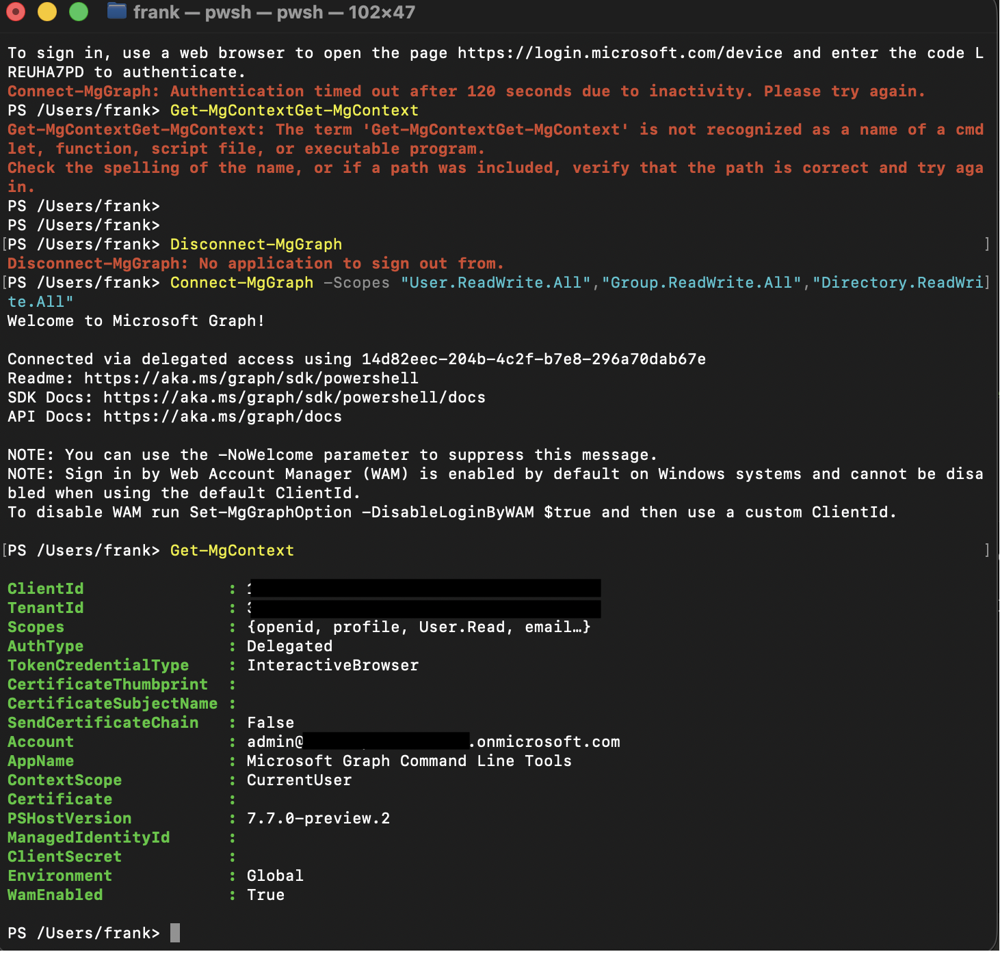
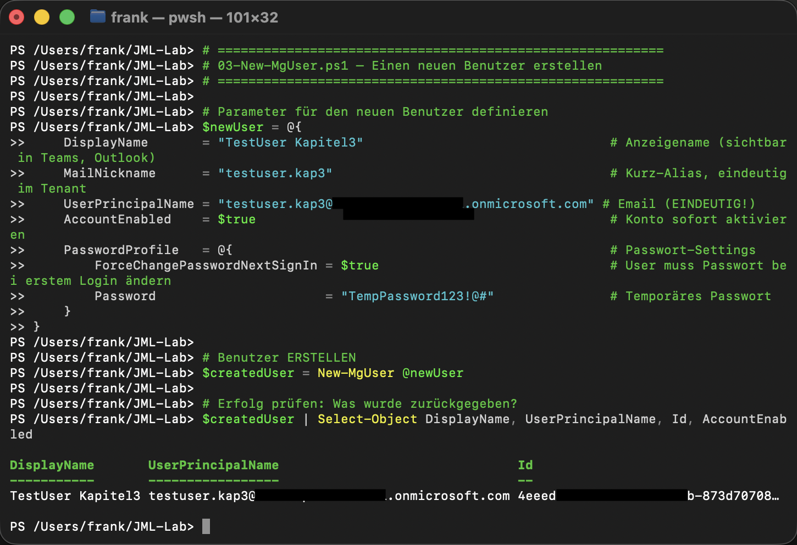

# JML-Lab: Joiner · Mover · Leaver mit Microsoft Graph PowerShell

Automatisierung des kompletten Identity-Lifecycles in Microsoft Entra ID:
vom Anlegen eines Mitarbeiters (Joiner) über den Abteilungswechsel (Mover)
bis zum Offboarding (Leaver), ausschließlich über das Microsoft Graph
PowerShell SDK.

Alle Skripte wurden in einem echten Entra-Tenant ausgeführt. Die Screenshots
im Ordner `images/` zeigen die tatsächlichen Ergebnisse.

## Projektstruktur

```text
JML-Lab/
├── README.md
├── .gitignore
├── scripts/
│   ├── 01-Connect-MgGraph.ps1     # Verbindung + Scopes
│   ├── 02-Get-MgUser.ps1          # Benutzer lesen/suchen
│   ├── 03-New-MgUser.ps1          # Benutzer anlegen (Joiner)
│   ├── 04-Update-MgUser.ps1       # Attribute ändern (Mover)
│   ├── 05-Add-MgGroupMember.ps1   # Gruppenmitgliedschaft
│   ├── 06-Set-MgUserLicense.ps1   # Lizenz zuweisen
│   ├── 07-Disable-MgUser.ps1      # deaktivieren (Leaver 1)
│   └── 08-Remove-MgUser.ps1       # löschen (Leaver 2)
├── docs/
│   └── JML-Automation-Cheatsheet.md
└── images/
    └── 01–08 Screenshots der ausgeführten Schritte
```

## Voraussetzungen

- PowerShell 7
- Microsoft.Graph PowerShell SDK (`Install-Module Microsoft.Graph -Scope CurrentUser`)
- Ein Microsoft-Entra-Tenant mit Admin-Rechten
- Scopes: `User.ReadWrite.All`, `Group.ReadWrite.All`, `Directory.ReadWrite.All`

## Die 8 Schritte im Überblick

| # | Befehl | Aktion | JML-Phase |
|---|--------|--------|-----------|
| 1 | `Connect-MgGraph` | Verbindung + Rechte | Basis |
| 2 | `Get-MgUser` | Benutzer lesen/suchen | Lesen |
| 3 | `New-MgUser` | Benutzer anlegen | Joiner |
| 4 | `Update-MgUser` | Attribute ändern | Mover |
| 5 | `New-MgGroupMember` | Gruppe zuweisen | Joiner |
| 6 | `Set-MgUserLicense` | Lizenz zuweisen | Joiner |
| 7 | `Update-MgUser` (AccountEnabled=$false) | deaktivieren | Leaver |
| 8 | `Remove-MgUser` | löschen | Leaver |

## Ergebnisse der 8 Schritte

**1. Verbunden mit Microsoft Graph**



**2. Benutzer lesen (Top 5)**


**3. Joiner: Benutzer angelegt**



**4. Mover: Attribute geändert**


**5. Joiner: in Gruppe aufgenommen**


**6. Joiner: Lizenzzuweisung (Struktur)**


**7. Leaver: Konto deaktiviert**


**8. Leaver: Konto gelöscht**


## Anwendung

```powershell
# 1. Verbinden
./scripts/01-Connect-MgGraph.ps1

# 2. Joiner: Benutzer anlegen, in Gruppe, Lizenz
./scripts/03-New-MgUser.ps1
./scripts/05-Add-MgGroupMember.ps1
./scripts/06-Set-MgUserLicense.ps1

# 3. Mover: Abteilung wechseln
./scripts/04-Update-MgUser.ps1

# 4. Leaver: deaktivieren, dann löschen
./scripts/07-Disable-MgUser.ps1
./scripts/08-Remove-MgUser.ps1
```

---

## Was ich in diesem Lab gebaut habe

Über Microsoft Graph in PowerShell, auf meinen echten Tenant, habe ich den
kompletten JML-Prozess einmal von Hand durchgespielt, sprich nach dem Einloggen
habe ich einen Benutzer angelegt, ihm eine Gruppe zugewiesen, die Lizenz-Struktur
aufgebaut, Attribute geändert, den Account deaktiviert und schließlich gelöscht.

## Stolpersteine (echte Fehler aus dem Aufbau)

### Nummer 1

Direkt zu Beginn habe ich mich im falsches Konto eingeloggt, sprich beim ersten
`Connect-MgGraph` hatte ich mich mit meinem privaten Microsoft-Konto statt mit dem
Firmen-Tenant angemeldet, danach lief gar nichts. Jedoch habe ich sehr schnell die
Lösung umgesetzt: `Disconnect-MgGraph` und neu mit dem richtigen Admin-Konto
verbinden. Seitdem prüfe ich nach dem Verbinden immer zuerst `Get-MgContext`.

### Nummer 2

Device-Code-Timeout auf macOS: `-UseDeviceAuthentication` lief nach 120 Sekunden
in einen Timeout. Der normale interaktive Browser-Login war die zuverlässigere
Variante.

### Nummer 3

Falsche Update-Syntax: `Update-MgUser -UserId $id -AccountEnabled $false` warf
„positional parameter cannot be found". Richtig ist
`-BodyParameter @{ AccountEnabled = $false }`.

### Nummer 4

Lizenz ohne SKU: `Set-MgUserLicense` meldete „does not correspond to a valid
company License", weil der Dev-Tenant keine gekauften Lizenzen hat. Die
Zuweisungs-Struktur bleibt trotzdem identisch.

---

## Nächster Schritt: CSV-Massenbetrieb (in Arbeit)

Die acht Skripte oben arbeiten mit einem fest eingetragenen Testbenutzer. Im echten Betrieb kommen Ein- und Austritte als Liste aus der Personalabteilung. Deshalb entsteht gerade ein neuntes Skript, das eine CSV-Datei abarbeitet (Spaltenschema siehe [`beispiel-mitarbeiter.csv`](beispiel-mitarbeiter.csv)):

- **Trockenlauf als Standard.** Ohne ausdrücklichen Schalter wird nur angezeigt, was passieren würde.
- **Idempotent.** Was schon erledigt ist, wird erkannt und nicht doppelt ausgeführt. Zweimal laufen lassen richtet keinen Schaden an.
- **Fehler pro Zeile.** Eine kaputte Zeile bricht nicht den ganzen Lauf ab.
- **Protokoll.** Zeitstempel und Ergebnis je Zeile, Zusammenfassung am Ende.
- **Leaver vollständig:** deaktivieren, Sitzungen widerrufen (`Revoke-MgUserSignInSession`), aus Gruppen entfernen, Lizenz entziehen.
