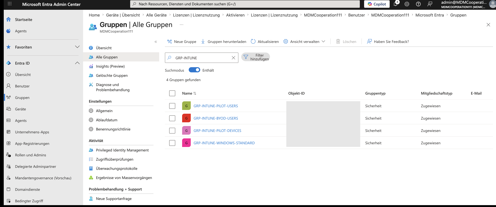
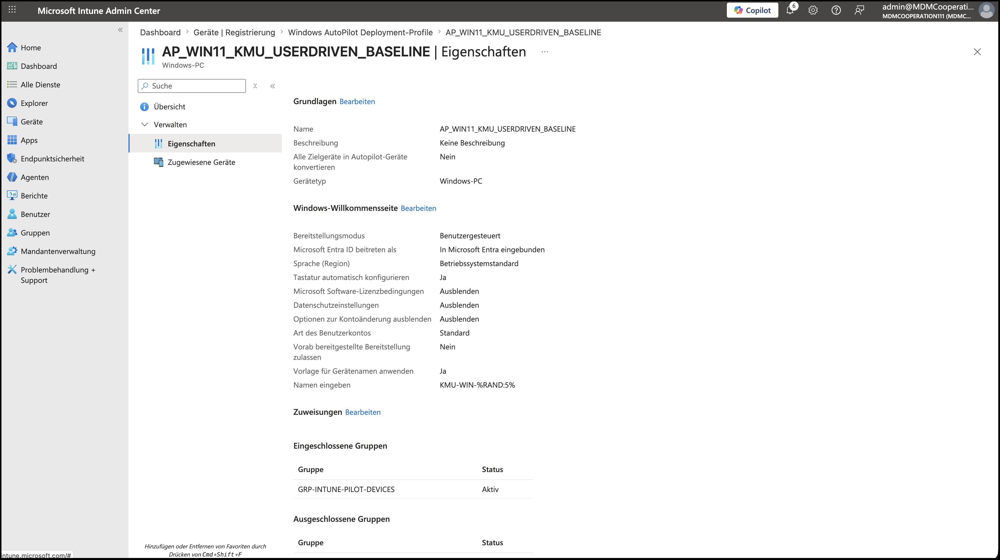

# 02 – Windows-Geräte & Autopilot

## Ausgangslage

Ein neues Notebook wird in vielen kleinen Firmen immer noch von Hand eingerichtet: Windows installieren, Updates, Office, Benutzer anlegen, Netzlaufwerke. Pro Gerät ein bis zwei Stunden, und jedes Gerät ist am Ende ein bisschen anders.

Das Ziel ist das Gegenteil: Das Gerät tritt Entra ID bei, landet automatisch in Intune und bekommt Richtlinien und Apps ohne dass jemand es anfasst. Autopilot ist der Schritt, der das auch für die Ersteinrichtung (OOBE) abdeckt.

## Umgesetzt

**Entra Join mit automatischer Intune-Registrierung**

| Punkt | Umsetzung |
|---|---|
| Gerät | Windows 11 als virtuelle Maschine auf einem MacBook Pro (ARM) |
| Beitritt | Microsoft Entra Join |
| MDM-Registrierung | automatisch über den Entra Join (MDM-Benutzerbereich) |
| Ergebnis | Gerät in Intune verwaltet, Compliance wird ausgewertet (siehe [03](../03-compliance-ca/)). Das MacBook selbst war über das Unternehmensportal registriert. |
| App-Bereitstellung | Microsoft 365 Apps, zusätzlich Google Chrome als Win32-App |

**Gruppenstruktur in Entra ID**

| Gruppe | Mitglieder | Wofür |
|---|---|---|
| `GRP-INTUNE-PILOT-USERS` | Benutzer | Pilotbenutzer für neue Richtlinien |
| `GRP-INTUNE-BYOD-USERS` | Benutzer | Privatgeräte, App-Schutz statt Geräteverwaltung |
| `GRP-INTUNE-PILOT-DEVICES` | Geräte | Ziel des Autopilot-Profils |
| `GRP-INTUNE-WINDOWS-STANDARD` | Geräte | Standard-Konfiguration und Compliance für Windows |

Getrennte Benutzer- und Gerätegruppen sind kein Selbstzweck. Autopilot-Profile und viele Gerätekonfigurationen greifen nur zuverlässig, wenn sie an Geräte zugewiesen sind. Bei den Android-Kiosk-Geräten in [04](../04-android-enterprise/) bin ich genau darüber gestolpert.

**Autopilot-Profil `AP_WIN11_KMU_USERDRIVEN_BASELINE`**

| Einstellung | Wert | Warum |
|---|---|---|
| Bereitstellungsmodus | Benutzergesteuert | Standardfall im Mittelstand: ein Gerät, ein Mitarbeiter |
| Entra ID beitreten als | In Microsoft Entra eingebunden | Reiner Cloud-Join, kein Hybrid Join |
| Lizenzbedingungen, Datenschutz | Ausblenden | Weniger Klicks, weniger Rückfragen beim Anwender |
| Optionen zur Kontoänderung | Ausblenden | Auf der Firmen-Anmeldeseite gibt es kein „Anderes Konto verwenden“ bzw. „Neu starten“, der Anwender bleibt im vorgesehenen Ablauf |
| Art des Benutzerkontos | Standard | Kein lokaler Administrator |
| Vorab bereitgestellte Bereitstellung | Nein | Kein White Glove, Einrichtung durch den Anwender |
| Gerätenamensvorlage | `KMU-WIN-%RAND:5%` | Einheitliche Namen ohne manuelle Vergabe |
| Zuweisung | `GRP-INTUNE-PILOT-DEVICES` | Erst Pilotgeräte, dann Ausweitung |

## Stolperstein

> **Chrome als Win32-App: „installiert“, aber nicht startbar**
> Symptom: Intune meldete die Win32-App Google Chrome als erfolgreich installiert, auf dem Gerät gab es aber keine ausführbare Anwendung.
> Ursache: Die Test-VM läuft auf Windows 11 ARM. Das Paket lieferte dort keine startbare Anwendung, die Erkennungsregel meldete trotzdem Erfolg.
> Erkenntnis: „Installiert“ in Intune heißt nur, dass die Erkennungsregel zutrifft. Die Regel sollte deshalb auf die tatsächliche Programmdatei prüfen, nicht nur auf einen Registry-Eintrag oder Ordner. Und bei gemischten Flotten (x64 / ARM) das passende Paket je Architektur über Filter zuweisen.

## Nächste Stufe (neuer Testmandant)

Der ursprüngliche Testmandant ist geschlossen. Das Autopilot-Profil war angelegt und zugewiesen, einen vollständigen Autopilot-Durchlauf habe ich dort nicht mehr dokumentiert. Im neuen Mandanten:

- Hardware-Hash importieren, Gerät dem Profil zuweisen, Durchlauf mit Willkommensseite und Enrollment Status Page, am Ende verwaltet und konform. Mit Screenshots und der Dauer bis zum arbeitsfähigen Gerät.
- Unternehmensbranding auf der Anmeldeseite.
