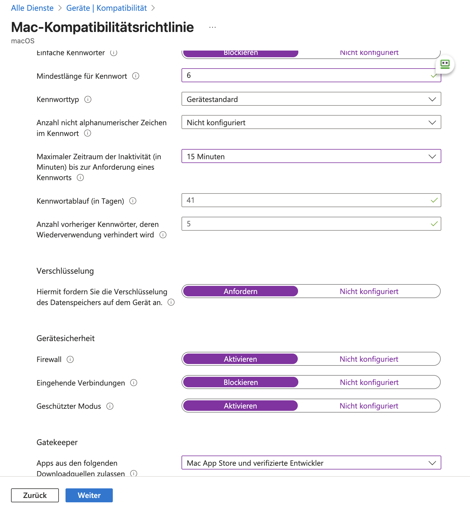

# 03 – Compliance & Conditional Access

## Ausgangslage

Ohne Conditional Access ist Microsoft 365 von jedem Gerät der Welt erreichbar, sobald jemand Benutzername und Passwort kennt. Mit CA lautet die Frage nicht mehr „kennt jemand das Passwort“, sondern „ist das ein bekannter Benutzer mit zweitem Faktor, auf einem Gerät, das wir verwalten“.

Der technische Teil ist schnell erledigt. Heikel ist der Rollout: Eine falsch scharf geschaltete Richtlinie sperrt im schlimmsten Fall alle aus, auch die Admins.

## Wie Intune und Conditional Access zusammenspielen

```
Compliance-Richtlinie (Intune) ──► Gerät ist konform / nicht konform
                                              │
CA-Richtlinie „konformes Gerät erforderlich“ ─┴─► Zugriff erlaubt / blockiert
```

Intune bewertet das Gerät, Conditional Access trifft die Entscheidung. Ohne Compliance-Richtlinie hat CA nichts, worauf es sich stützen kann.

## Umgesetzt

Aufgebaut habe ich das während der Vorbereitung auf die MD-102, in einem Testmandanten mit Microsoft 365 Business Premium. Verwaltet wurden zwei Geräte:

| Gerät | Registrierung |
|---|---|
| MacBook Pro (macOS) | vollständig in Intune registriert, über das Unternehmensportal |
| Windows 11 als VM auf dem MacBook (ARM) | Entra Join mit automatischer Intune-Registrierung, siehe [02](../02-autopilot/) |

### 1. Security Defaults deaktiviert

Security Defaults und eigene CA-Richtlinien schließen sich aus. Wer Conditional Access nutzen will, muss die Sicherheitsstandards abschalten. Die Reihenfolge ist deshalb wichtig: erst die CA-Richtlinie für MFA vorbereiten, dann die Security Defaults abschalten, dann die Richtlinie aktivieren. Sonst gibt es ein Zeitfenster ganz ohne MFA.

### 2. Compliance-Richtlinien

**Windows**

| Regel | Wert |
|---|---|
| Kennwort zum Entsperren erforderlich | ja |

Bewusst klein gehalten, damit die Kette Gerät → Compliance → CA zuerst funktioniert. Auf der ARM-VM sind Prüfungen wie BitLocker oder Secure Boot ohnehin nur eingeschränkt aussagekräftig.

**macOS** (für das registrierte MacBook)



| Bereich | Regel | Wert |
|---|---|---|
| Kennwort | Einfache Kennwörter | blockiert |
| | Mindestlänge | 6 |
| | Inaktivität bis Kennwortabfrage | 15 Minuten |
| | Kennwortablauf | 41 Tage |
| | Kennwortverlauf | 5 |
| Verschlüsselung | Datenspeicher verschlüsselt (FileVault) | erforderlich |
| Gerätesicherheit | Firewall | aktiviert |
| | Eingehende Verbindungen | blockiert |
| | Geschützter Modus (Stealth Mode) | aktiviert |
| Gatekeeper | Erlaubte Quellen | Mac App Store und verifizierte Entwickler |

### 3. Conditional Access

| Richtlinie | Wirkung | Zielgruppe | Modus |
|---|---|---|---|
| MFA für alle | MFA erforderlich | Alle Benutzer | Nur Bericht |
| Konformes Gerät | Zugriff auf Microsoft 365 nur von konformen Geräten | Alle Benutzer | Nur Bericht |

Beide Richtlinien liefen im Modus **„Nur Bericht“**. So sieht man im Anmeldeprotokoll, was sie bewirken würden, ohne jemanden auszusperren. Scharf geschaltet und mit Notfallkonto abgesichert habe ich sie in diesem Mandanten nicht mehr.

Der Testmandant ist inzwischen geschlossen, Screenshots der CA-Richtlinien gibt es daraus nicht. Für den nächsten Durchlauf gilt das Namensschema aus dem [Haupt-README](../README.md#namenskonventionen), z. B. `CA01-MFA-AlleBenutzer`.

## Rollout-Verfahren

So führe ich eine neue Richtlinie in einem Kundenmandanten ein:

1. **Ist-Stand sichern.** Alle bestehenden CA-Richtlinien als JSON exportieren.
2. **Notfallkonten zuerst.** Zwei Cloud-only-Konten, aus allen CA-Richtlinien ausgenommen, Anmeldung wird überwacht.
3. **Modus „Nur Bericht“.** Mehrere Tage laufen lassen und im Anmeldeprotokoll auswerten: Wer wäre blockiert worden und warum?
4. **Für jeden Treffer entscheiden:** Ausnahme, Umstellung (z. B. Scan-to-Mail auf OAuth) oder bewusst blockieren.
5. **Pilotgruppe**, dann Ausweitung in Wellen.
6. **Rückweg dokumentieren:** Richtlinie auf „Aus“, wirkt ab der nächsten Tokenanforderung.

In einem gewachsenen Mandanten kommt die Gerätekonformitäts-Richtlinie zuletzt, weil sie voraussetzt, dass alle Geräte bereits verwaltet und konform sind.

## Nächste Stufe (neuer Testmandant)

- Notfallkonten anlegen und in allen Richtlinien ausnehmen.
- Die beiden Richtlinien aus „Nur Bericht“ auswerten und scharf schalten, dazu `CA02-Block-LegacyAuth` und `CA04-MFA-Admins`.
- Nachweis mit Screenshots: CA-Übersicht, Auswertung „Nur Bericht“ und vor allem die Blockade-Meldung auf einem nicht konformen Gerät.
- Windows-Compliance erweitern: BitLocker, Defender, Mindestversion (auf einem x64-Testgerät).
