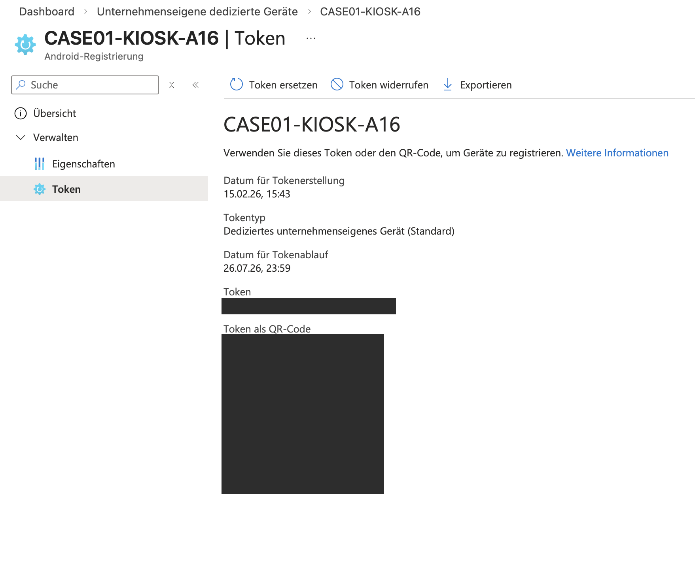
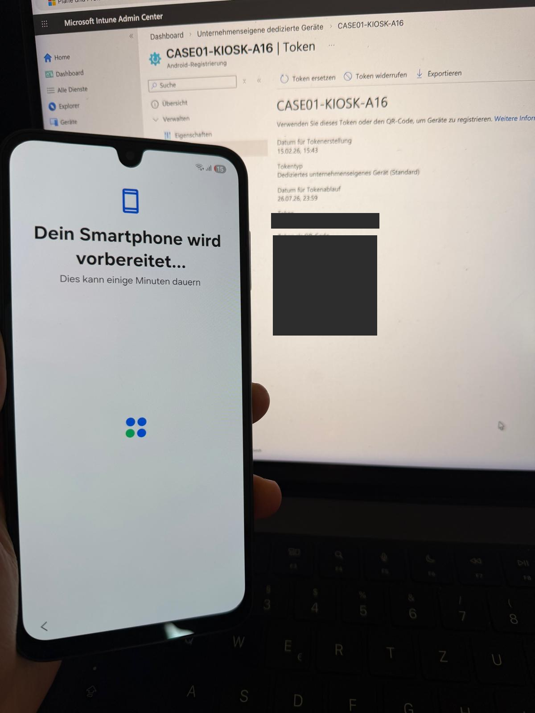
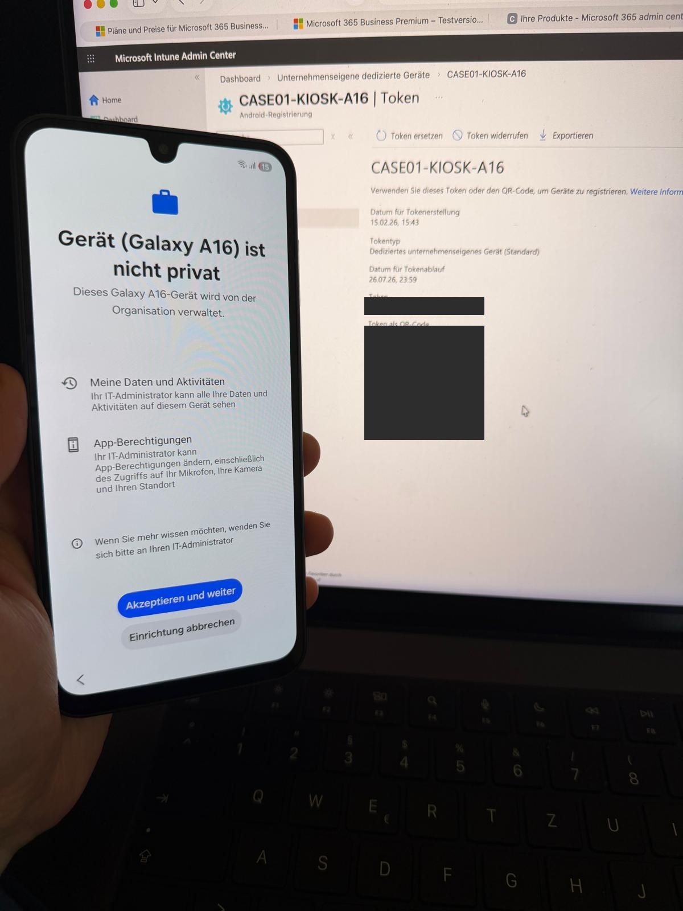
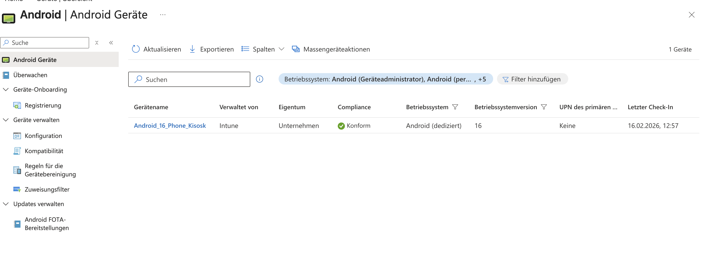
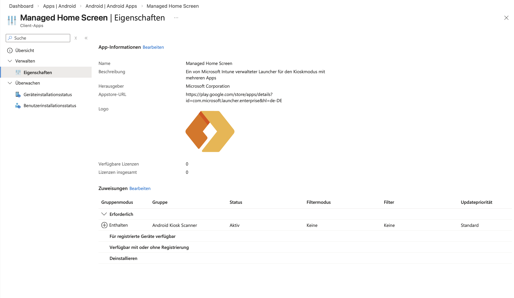
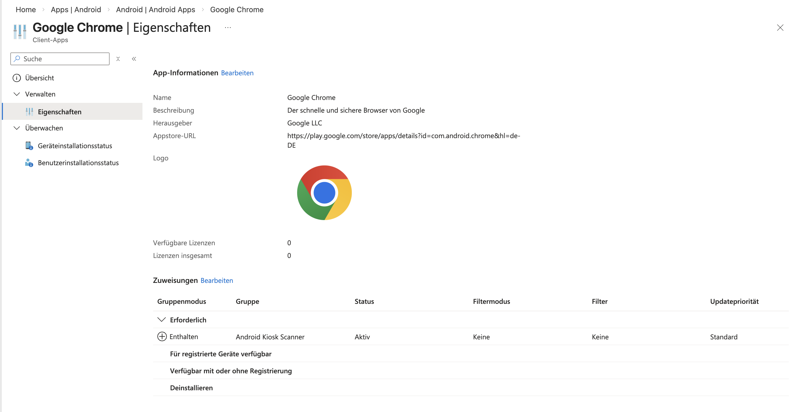
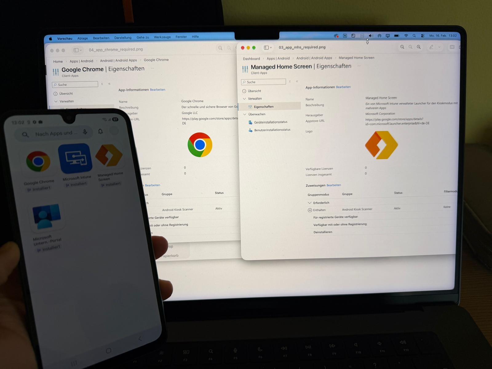

# 04 – Android Enterprise

Im Mittelstand kommen zwei Arten von Android-Geräten nebeneinander vor, und sie unterscheiden sich in einem Punkt grundlegend: **Hat das Gerät einen Benutzer oder nicht?**

| | A: Gerät mit Benutzer | B: Dediziertes Gerät (Kiosk) |
|---|---|---|
| Typischer Einsatz | Diensthandy, BYOD | Lagerscanner, Tablet am Empfang, Werkstatt |
| Anmeldung | Mitarbeiter mit Entra-Konto | keine persönliche Anmeldung |
| Conditional Access | greift, weil sich ein Benutzer anmeldet | benutzerbasierte CA greift nicht |
| Apps und Richtlinien zuweisen an | Benutzer- oder Gerätegruppen | **nur Gerätegruppen** sinnvoll |
| Schutz über | Compliance + CA | Compliance + Sperrmodus + Fernlöschung |

Die vorletzte Zeile ist genau der Punkt, an dem ich im Lab hängen geblieben bin (siehe Stolpersteine).

---

## B – Dediziertes Gerät (Kiosk)

### Ausgangslage

Nicht jedes Firmengerät hat einen Besitzer. Scanner im Lager oder Tablets in der Werkstatt gehören der Firma, werden von wechselnden Leuten benutzt und sollen genau eine Aufgabe erfüllen. Ohne Verwaltung landen darauf private Apps, das Gerät wird zweckentfremdet, und bei Verlust hat man keinen Zugriff mehr darauf.

### Konfiguration

| Punkt | Wert |
|---|---|
| Registrierungsprofil | `CASE01-KIOSK-A16` |
| Registrierungsart | Dediziertes unternehmenseigenes Gerät, Token / QR-Code |
| Gerät | Samsung Galaxy A16, Android 16 |
| Gerätename in Intune | `Android_16_Phone_Kisosk` |
| Zielgruppe | `Android Kiosk Scanner` |
| Launcher | Managed Home Screen (`com.microsoft.launcher.enterprise`), erforderlich |
| Freigegebene App | Google Chrome, erforderlich |
| App-Quelle | Verwaltetes Google Play |
| Compliance-Status | konform |

### Ablauf mit Nachweisen

**1. Registrierungsprofil mit Token und QR-Code angelegt** (15.02.2026)

**2. Gerät auf Werkseinstellungen, im ersten Einrichtungsbildschirm sechsmal auf das Display tippen**, der QR-Scanner öffnet sich, QR-Code scannen

**3. Android meldet das Gerät als unternehmensverwaltet**

**4. Gerät erscheint in Intune:** verwaltet von Intune, Eigentum Unternehmen, Android (dediziert), konform, kein primärer Benutzer (16.02.2026)

**5. Apps aus verwaltetem Google Play als „Erforderlich“ zugewiesen**

**6. Apps automatisch auf dem Gerät installiert:** Google Chrome, Microsoft Intune, Managed Home Screen, Unternehmensportal

### Stolpersteine

> **1. Falscher App-Typ**
> Symptom: Chrome ließ sich beim Hinzufügen der App nicht auswählen.
> Ursache: Im Dropdown war „Android Enterprise-System-App“ gewählt. Dieser Typ ist nur für Apps gedacht, die schon auf dem Gerät vorinstalliert sind.
> Behebung: Chrome und Managed Home Screen als „Verwaltete Google Play-App“ hinzugefügt.

> **2. Apps kommen auf dem dedizierten Gerät nicht an**
> Symptom: Apps waren als „Erforderlich“ zugewiesen, auf dem Gerät tat sich nichts.
> Ursache: In der Zielgruppe stand ein Benutzer, nicht das Gerät. Ein dediziertes Gerät hat keinen primären Benutzer (in Intune steht bei UPN „Keine“), eine benutzerbasierte Zuweisung erreicht es also nie.
> Behebung: Das Gerät selbst als Mitglied in die Gruppe aufgenommen. Für dedizierte Geräte weise ich seitdem grundsätzlich an Gerätegruppen zu, bei mehreren Geräten über eine dynamische Gerätegruppe nach Registrierungsprofil.

> **3. Registrierungstoken im Screenshot geteilt**
> Symptom: Der erste Screenshot des Registrierungsprofils zeigte Token und QR-Code im Klartext.
> Risiko: Mit dem Token kann jeder ein Gerät in den Mandanten registrieren, solange es gültig ist.
> Behebung: Token widerrufen. Alle Bilder in diesem Repository sind geschwärzt.

### Fernaktionen

Am registrierten Gerät habe ich die Fernaktionen aus Intune ausprobiert: Ton abspielen (Gerät finden), Gerät sperren und Zurücksetzen auf Werkseinstellungen (Wipe). Fotos davon habe ich nicht.

### Stand beim Sperrmodus

Ziel war ein Gerät wie ein Lagerscanner: Beim Einschalten öffnet sich nur die Firmen-App, sonst nichts. So weit bin ich nicht gegangen. Umgesetzt habe ich zwei Pflicht-Apps (Managed Home Screen und Chrome) und danach die übrigen Apps eingeschränkt. Einen Nachweis vom gesperrten Zustand gibt es nicht; auf dem Foto in Schritt 6 ist noch die normale App-Ansicht zu sehen.

Der Testmandant ist inzwischen geschlossen und das Gerät nicht mehr registriert.

### Nächste Stufe (neuer Testmandant)

- Geräteeinschränkungsprofil mit Kioskmodus „Einzelne App“ bzw. „Mehrere Apps“ an eine Gerätegruppe.
- Foto vom gesperrten Gerät: Play Store, Einstellungen und Verlassen des Kiosks nicht möglich.
- Fernaktionen noch einmal durchspielen und diesmal mit Screenshots festhalten.

### Wofür man das verkauft

Logistik und Lager (Scanner), Handel (Beratungsterminals), Pflege und Werkstatt (geteilte Tablets), Empfang. Der Nutzen ist immer derselbe: Das Gerät lässt sich nicht zweckentfremden, und bei Verlust ist es mit einem Klick leer.

---

## A – Gerät mit Benutzer

Nicht Teil dieses Labs. Geräte mit Benutzer (Work Profile, Fully Managed) mit Compliance und Conditional Access kommen als nächste Ausbaustufe dazu.
