# 06 – Okta: Hands-on-Lab in zwei Trial-Orgs

Im August 2026 habe ich mich in zwei Okta-Workforce-Trials auf die Zertifizierungen Okta Certified Professional und Okta Certified Administrator vorbereitet. Beide habe ich bestanden. Die Aufgaben habe ich im Prüfungsstil gebaut, also mit festen Namen und Werten, aber ohne Klickanleitung, und dann in jeder Org ein zweites Mal aus dem Kopf.

Die Trials sind inzwischen abgelaufen. Die Screenshots unten stammen aus dieser Zeit. Dazu gehören auch die Fehler, die mir unterwegs passiert sind.

| | Org A | Org B |
|---|---|---|
| Zeitraum | 10.–15.08.2026 | 15.–16.08.2026 |
| Szenario | Finance: Benutzer, delegierter Helpdesk, Policies | Engineering: zweiter Durchlauf, App-Zuweisung, Offboarding |
| Rolle in der Föderation | Quelle (SAML-App) | Ziel (Identity Provider) |

Grenzen der Trials: 10 aktive Benutzer pro Org, kein Org2Org aus dem Katalog, kein Provisioning. Testbenutzer sind fiktiv.

---

## 1. Benutzer, Attribute, Gruppenregeln

**Custom Attribute** im Profile Editor: `costCenter` (Org A) und `deptCode` (Org B).

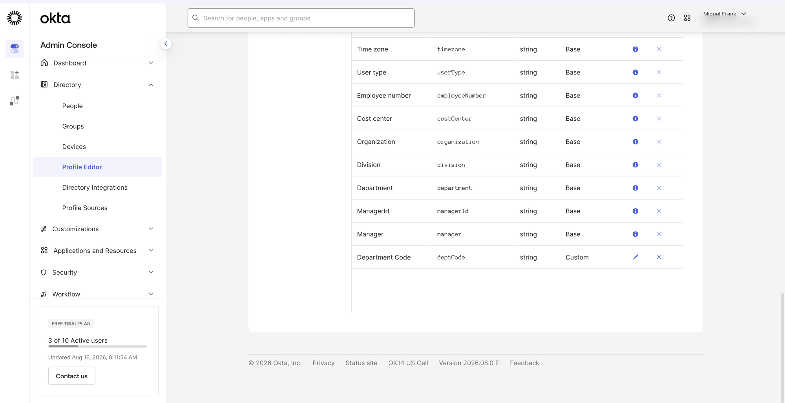

**Gruppenregel:** Wer `deptCode = ENG-100` hat, landet automatisch in `Engineering Team`. In der Gruppe steht dann „By rule“ statt „Manually“.

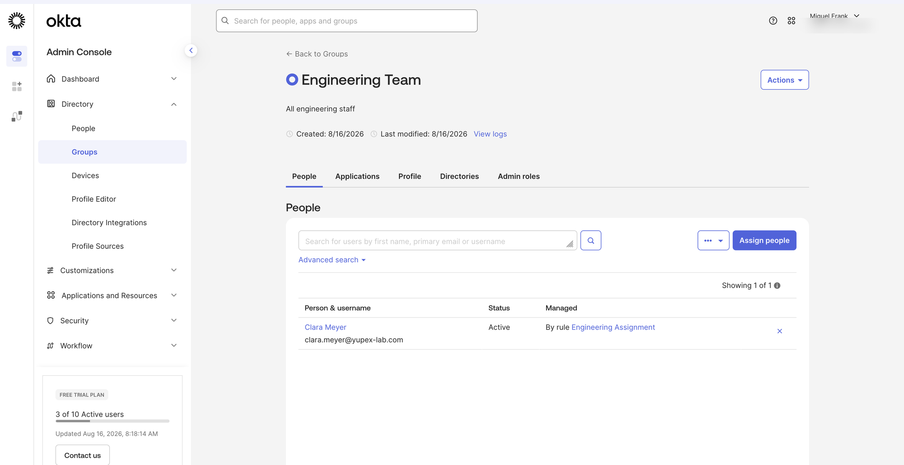

Wichtig: Eine Gruppenregel ist nach dem Speichern **inaktiv**, man muss sie erst aktivieren. Wer über eine Regel in die Gruppe kommt, lässt sich nicht von Hand entfernen.

**App über die Gruppe zugewiesen, nicht über die Person.** In der Admin-Ansicht steht als Quelle die Gruppe, und die Benutzerin sieht die Kachel in ihrem Dashboard:

| Admin-Sicht | Benutzer-Sicht |
|---|---|
| 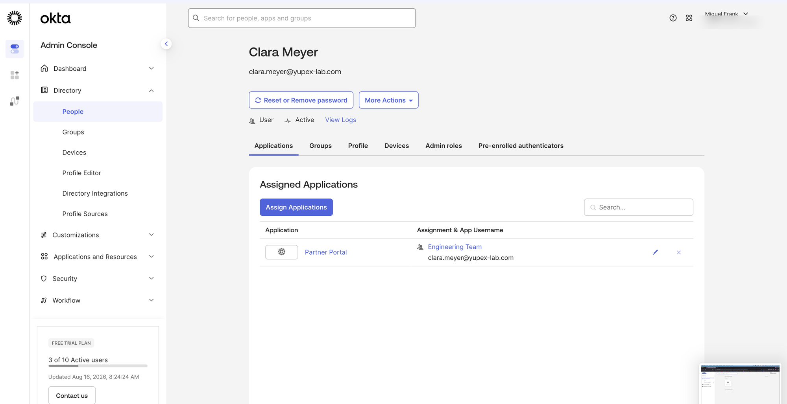 | 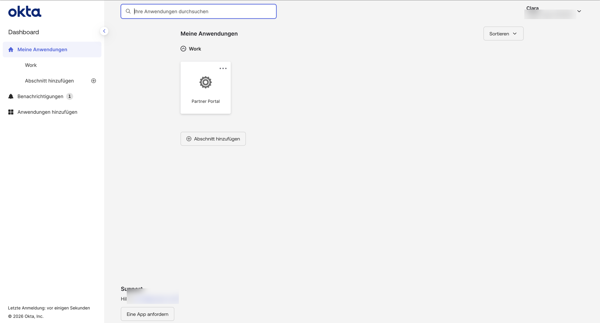 |

---

## 2. Delegierte Administration: Custom Role + Resource Set

Ziel: Ein Support-Team soll bei den Benutzern **einer** Gruppe Passwörter zurücksetzen und Profile ansehen dürfen, aber nicht im ganzen Mandanten. In Entra wäre das eine Rolle mit Administrative Unit.

Okta trennt das in zwei Objekte:
- **Rolle:** was jemand darf
- **Resource Set:** worauf er es darf

Erst bei der Zuweisung an die Admin-Gruppe kommen beide zusammen.

Reihenfolge unter Security → Administrators: **Resources → Roles → Admins**.

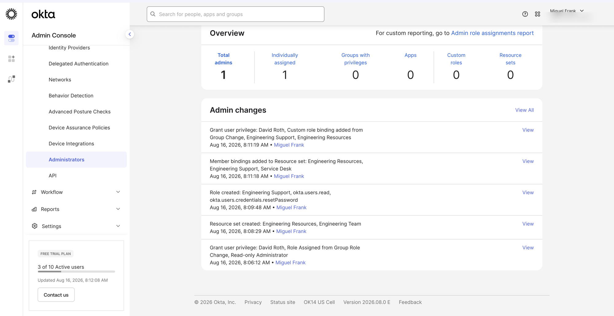

Das Protokoll zeigt den ganzen Ablauf:
1. Resource Set `Engineering Resources` angelegt (nur `Engineering Team`)
2. Custom Role `Engineering Support` mit genau zwei Berechtigungen: `okta.users.read` und `okta.users.credentials.resetPassword`
3. Beides an die Gruppe `Service Desk` gebunden

Ein Mitglied der Gruppe erbt die Rolle. Das Gruppen-Symbol vor der Rolle zeigt, dass sie nicht direkt zugewiesen ist:

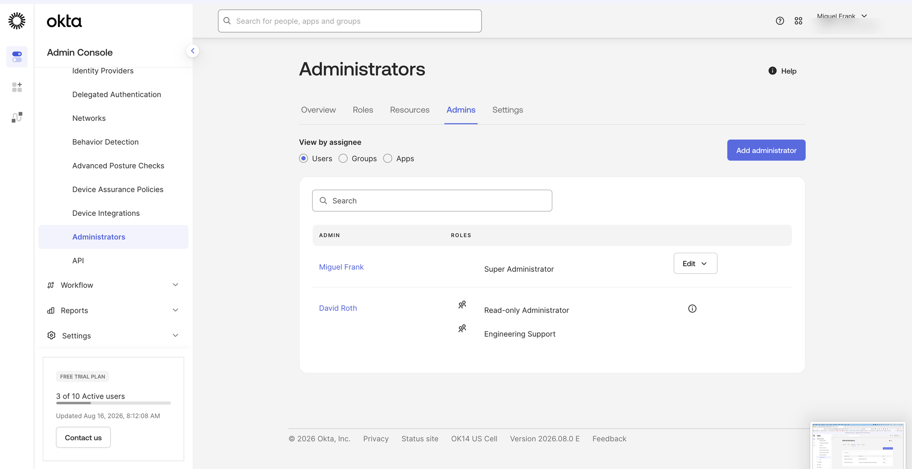

---

## 3. Richtlinien

Das Conditional Access aus Entra verteilt sich in Okta auf zwei getrennte Ebenen:

| Ebene | Frage |
|---|---|
| Global Session Policy | Darf der Benutzer überhaupt in die Org, und wie lange gilt die Sitzung? |
| Authentication Policy | Darf er in **diese** App, und mit wie vielen Faktoren? |

**Network Zone** als Bedingung für beide Ebenen:

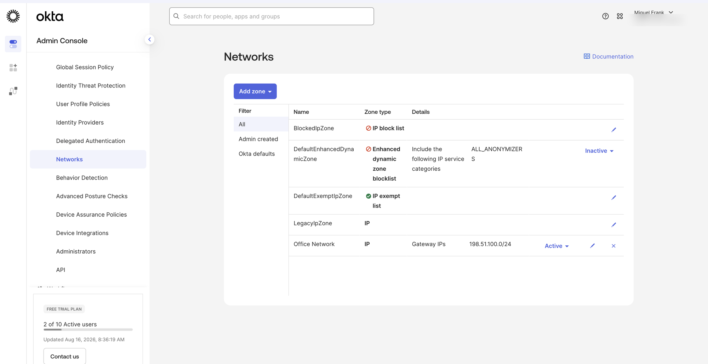

**Global Session Policy:** eigene Policy für `Engineering Team` mit MFA bei jeder Anmeldung, maximal 8 Stunden Sitzung, 15 Minuten Leerlauf und ohne dauerhaftes Cookie. Sie muss **über** der Default Policy stehen.

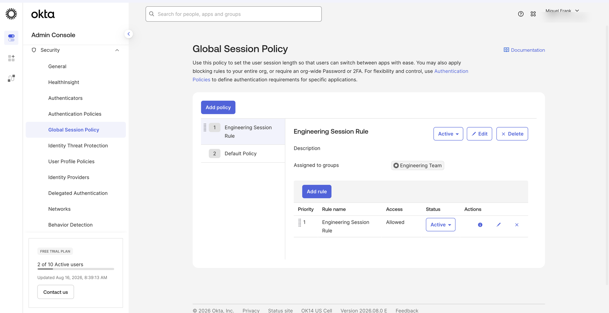

**Authentication Policy:** zwei Faktortypen und eine neue Anmeldung nach 4 Stunden. Der Schritt, der am häufigsten vergessen wird: die Policy der App zuweisen. Ohne diese Zuweisung greift sie nicht.

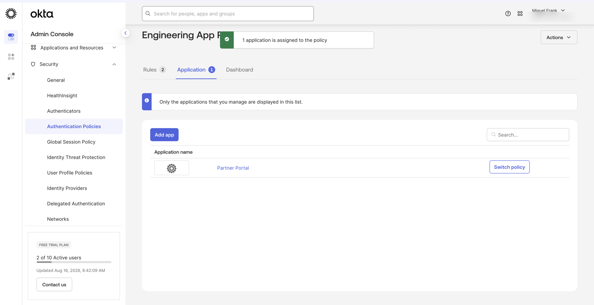

**Authenticator Enrollment:** Okta Verify und Passwort als Pflicht.

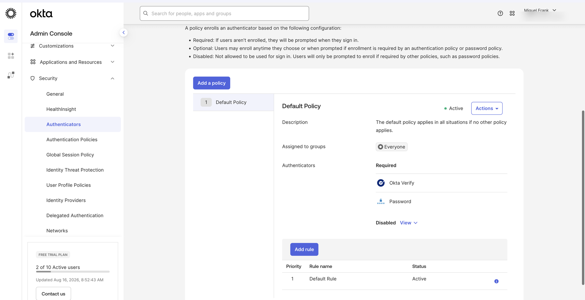

**Password Policy + Regel:** Die Policy legt fest, wie das Passwort aussehen muss: 10 Zeichen, Groß- und Kleinbuchstaben, Zahl, kein Teil des Benutzernamens, Sperre nach 3 Fehlversuchen. Die Regel legt fest, was der Benutzer damit tun darf: ändern, zurücksetzen, entsperren. Die Wiederherstellung läuft über die Authentication Policy (OIE-Weg), nicht über die Legacy-Einstellung.

| Policy + Regel | Self-Service in der Regel |
|---|---|
| 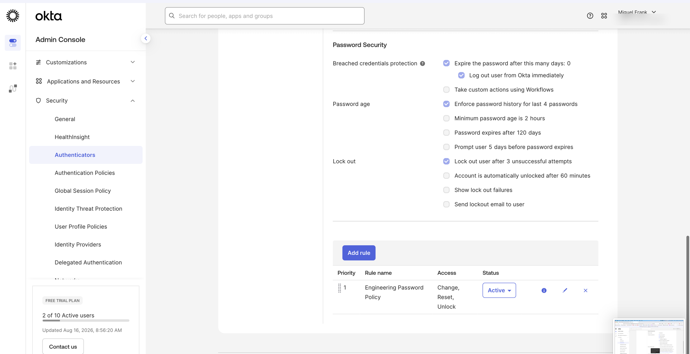 | 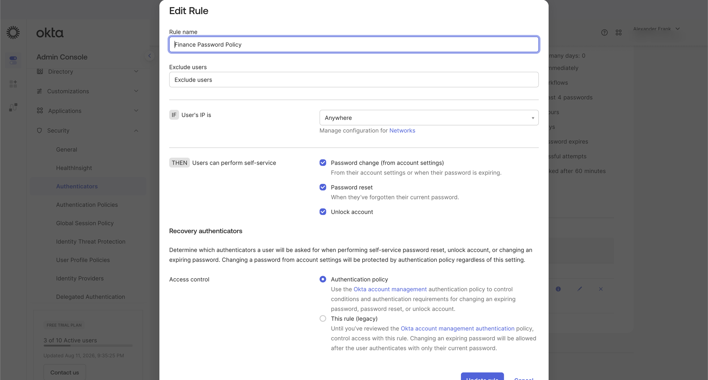 |

**Test aus Benutzersicht,** immer im privaten Fenster: Beim Login werden nur noch Passwort oder Okta FastPass angeboten, und die Benutzerin hat Okta Verify eingerichtet.

| Login | Konto der Benutzerin |
|---|---|
| 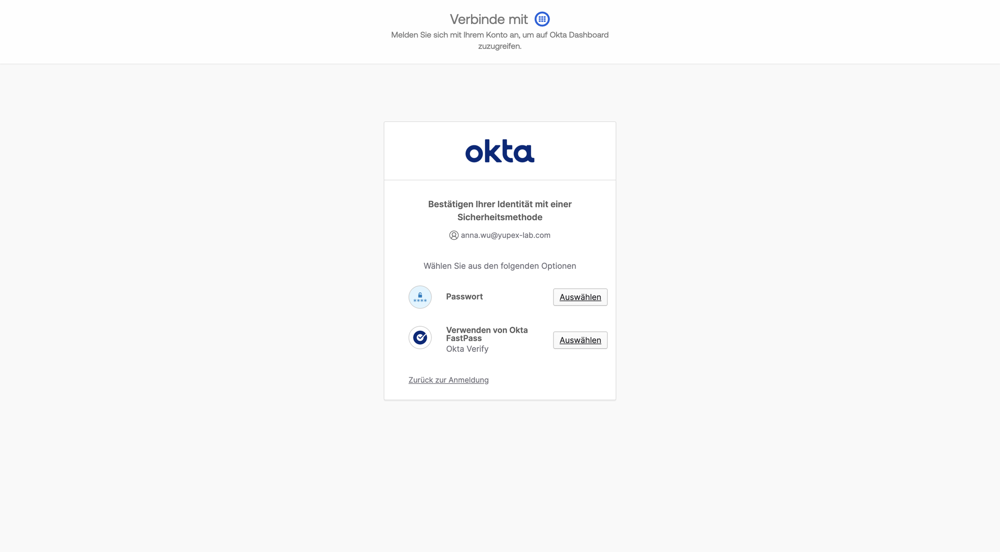 | 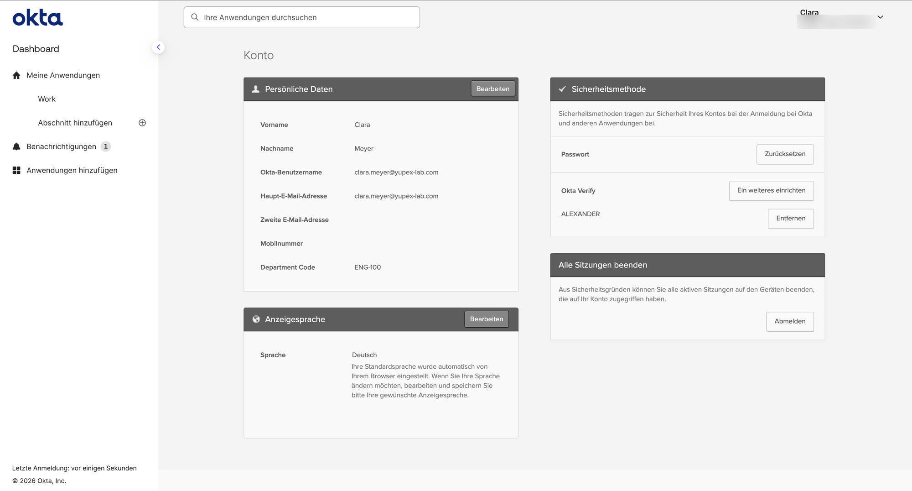 |

---

## 4. System Log

Nachweis, welche Regel bei einer Anmeldung gegriffen hat: `policy.evaluate_sign_on`, hier mit der `Finance Session Rule`.

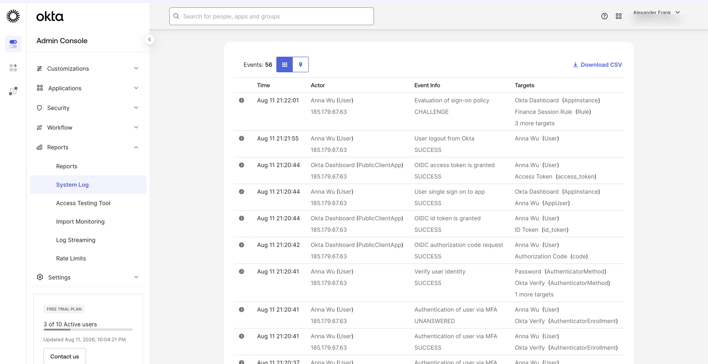

Die eigentliche Anmeldung ist `user.session.start`. Die Event-ID steht im aufgeklappten Ereignis:

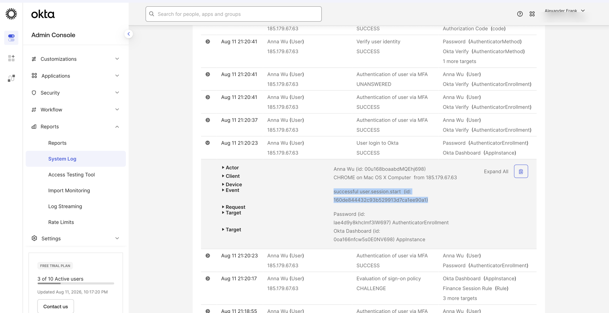

| Frage | Filter |
|---|---|
| Anmeldungen | `eventType eq "user.session.start"` |
| fehlgeschlagene Anmeldungen | `eventType eq "user.session.start" and outcome.result eq "FAILURE"` |
| Warum wurde geblockt? | `eventType eq "policy.evaluate_sign_on"`, Details unter `debugContext` |
| Kontosperre | `eventType eq "user.account.lock"` |
| Aufnahme in eine Gruppe | `eventType eq "group.user_membership.add"` |
| App per SSO geöffnet | `eventType eq "user.authentication.sso"` |

---

## 5. Offboarding

Ein deaktivierter Benutzer lässt sich nur noch wieder aktivieren oder löschen. In der Liste bleibt bei ihm nur die Admin Console stehen, und die kommt über die Service-Desk-Rolle, nicht über eine App-Zuweisung.

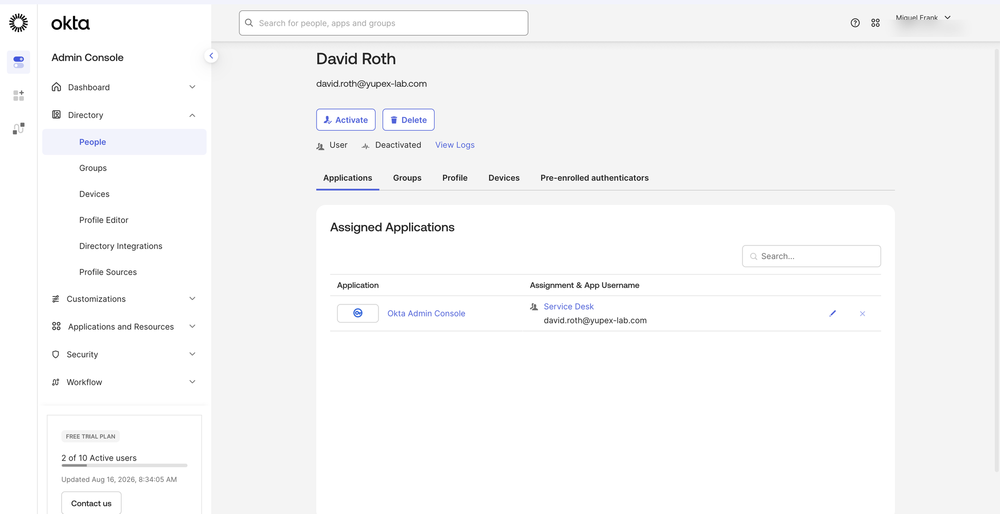

| Aktion | Wirkung | Wann |
|---|---|---|
| Suspend | Anmeldung gesperrt, Gruppen und Apps bleiben | vorübergehend |
| Deactivate | Konto aus, App-Zuweisungen entfernt | Austritt |

**Grenze im Lab:** Beim Attribut-Mapping der selbst gebauten App ließ sich in Richtung „Okta → App“ nur `userName` abbilden, weil das App-Profil keine weiteren Attribute enthielt.

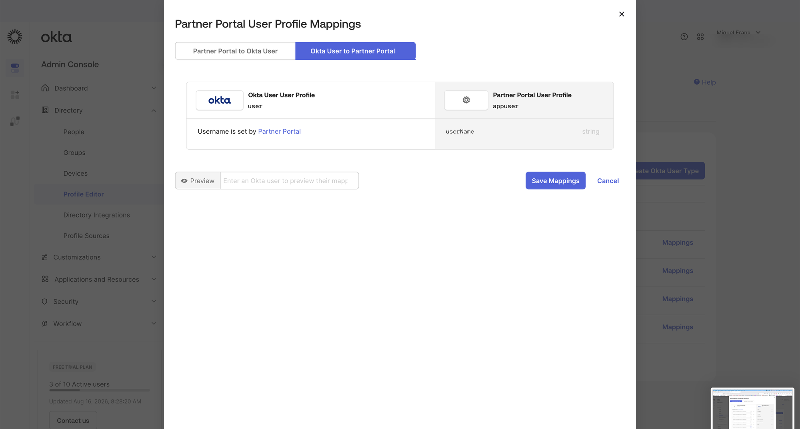

---

## 6. SAML-Föderation Org A → Org B (statt Org2Org)

Org2Org gibt es im Trial nicht. Deshalb habe ich die Verbindung von Hand gebaut:
- **Org A:** eine SAML-2.0-App
- **Org B:** ein SAML-Identity-Provider mit Just-in-Time-Anlage

Dabei gibt es ein Henne-Ei-Problem: Org A braucht die ACS-URL aus Org B, und Org B braucht Issuer, SSO-URL und Zertifikat aus Org A. Deshalb legt man die App zuerst mit Platzhaltern an und trägt die Werte danach ein.

In der App in Org A zeigt die Single-sign-on-URL auf den Identity Provider in Org B:

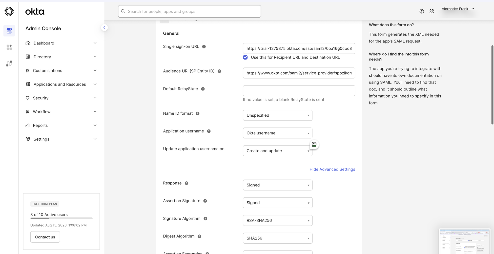

| # | Wo | Was |
|---|---|---|
| 1 | Org A | SAML-2.0-App mit Platzhaltern anlegen |
| 2 | Org A | IdP-SSO-URL, Issuer und Zertifikat aus „View SAML setup instructions“ kopieren |
| 3 | Org B | Identity Provider vom Typ SAML 2.0 anlegen: Werte aus Schritt 2, bei keinem Treffer **Create new user (JIT)**, Profile Master **nicht** aktivieren |
| 4 | Org B | ACS-URL und Audience URI notieren |
| 5 | Org A | Platzhalter ersetzen, Attribute Statements setzen, Gruppe zuweisen |

**Stand, ehrlich:** Der Handshake war konfiguriert. Einen erfolgreichen Login mit einem JIT-angelegten Benutzer in Org B habe ich nicht dokumentiert, bevor die Trials abgelaufen sind.

**Merksatz Org2Org:** Die App steht beim Spoke (Quelle), der Identity Provider beim Hub (Ziel).

| Org2Org (Katalog-App) | Nachbau |
|---|---|
| App „Okta Org2Org“ in der Quell-Org | eigene SAML-2.0-App |
| Identity Provider vom Typ Okta | Identity Provider vom Typ SAML 2.0 |
| Metadaten, ACS, Audience austauschen | identisch |
| JIT im Identity Provider | identisch |
| Provisioning per API-Token (Create / Update / Deactivate) | fehlt, nur JIT |

**Was JIT nicht kann:** JIT legt Benutzer beim ersten Login an, entfernt aber nie jemanden. Wird ein Benutzer in der Quell-Org deaktiviert, bleibt sein Konto in der Ziel-Org stehen. Dafür braucht es Provisioning (Org2Org, SCIM oder Lifecycle Management).

---

## Meine Fehler

**„Password expired“ direkt nach dem Anlegen**
- Symptom: Frisch angelegte Benutzer mit gesetztem Passwort standen sofort auf „Password expired“.
- Ursache: Beim Anlegen ist „User must change password on first sign-in“ vorausgewählt.
- Behebung: Haken entfernen, dann ist der Benutzer direkt „Active“.

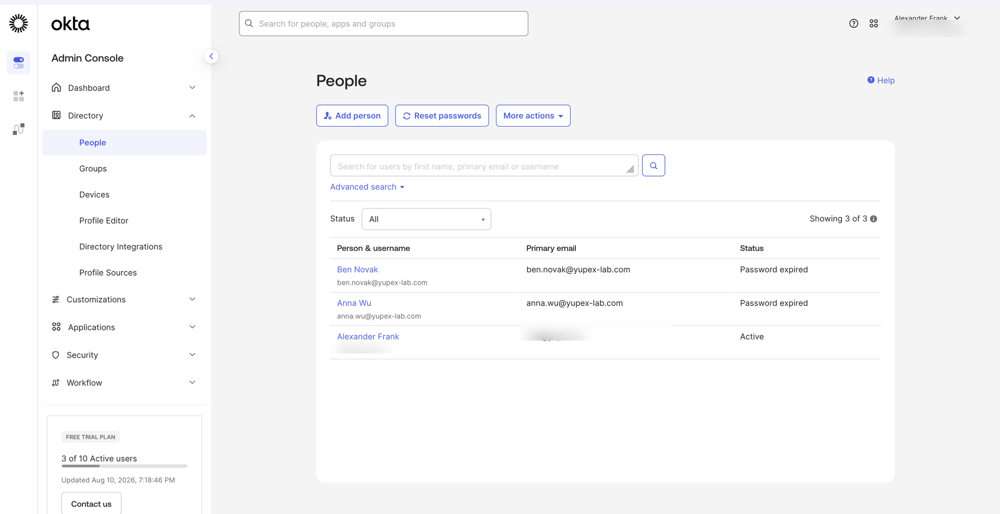

**Zweite Admin-Rolle hat die erste ersetzt**
- Symptom: Nach der Zuweisung der Custom Role war die Help-Desk-Rolle der Gruppe verschwunden.
- Ursache: Beim Bearbeiten der Gruppenzuweisung habe ich die bestehende Rolle ersetzt, statt eine weitere hinzuzufügen.
- Behebung: Zweite Zuweisung ergänzen. Danach prüfen, ob unter Admins **beide** Rollen stehen.

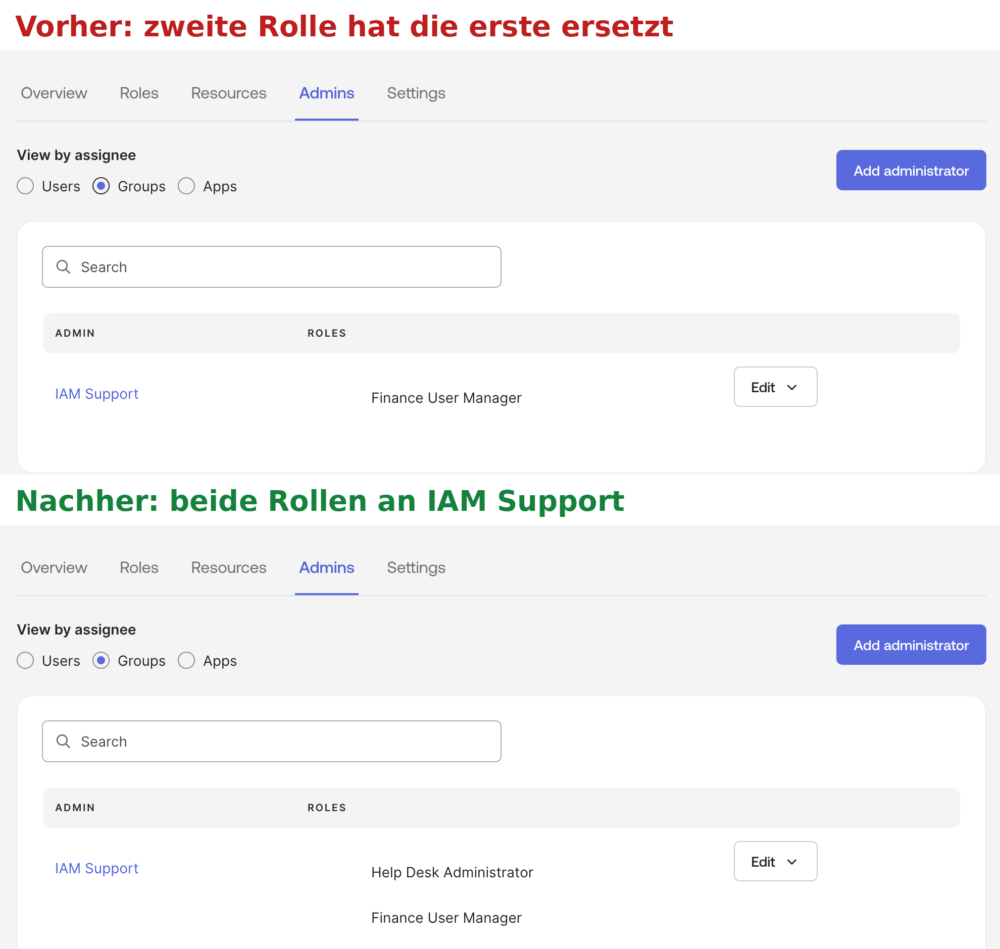

**Mehr konfiguriert als verlangt**
- Symptom: In der Authentication Policy waren „Phishing resistant“ und „Require user interaction“ aktiv, obwohl die Aufgabe nur zwei Faktortypen verlangte.
- Ursache: Okta setzt diese Possession-Constraints beim Anlegen einer Regel teilweise vor, und ich habe sie nicht abgewählt.
- Behebung: Voreinstellungen immer mitlesen, nicht nur die eigenen Eingaben.

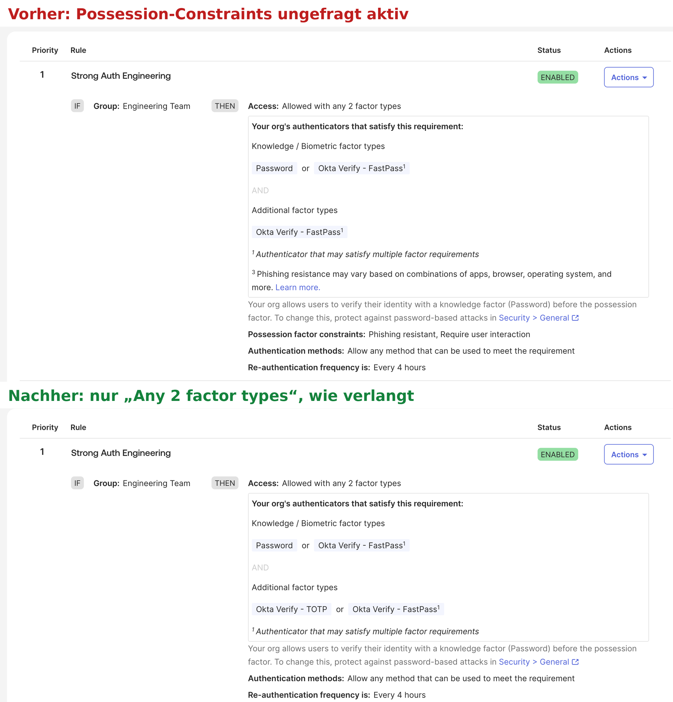

**Attribute Statements nicht gefunden**
- Symptom: Im Schulungsvideo standen die Attribute Statements direkt unter den SAML-Einstellungen. Bei mir folgte auf „Show Advanced Settings“ direkt Abschnitt B.
- Ursache: Die Oberfläche hat sich geändert. In meiner Org lagen sie im Tab **Sign On** unter „Show legacy configuration“.

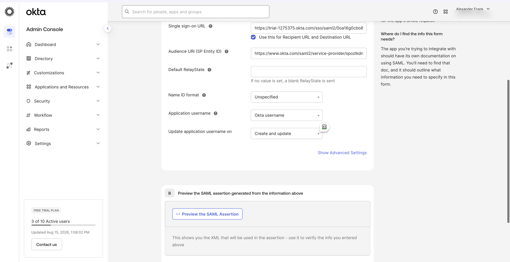

**System Log nach Gruppe gefiltert**
- Symptom: `eventType eq "user.session.start" and group eq "Finance Team"` lieferte keinen einzigen Treffer.
- Ursache: Anmeldeereignisse haben kein Gruppenfeld. Sie hängen am Benutzer.
- Behebung: Nach einem Mitglied filtern (`actor.alternateId eq "…"`). Außerdem den Zeitraum an die Aufgabe anpassen, voreingestellt sind die letzten 7 Tage.

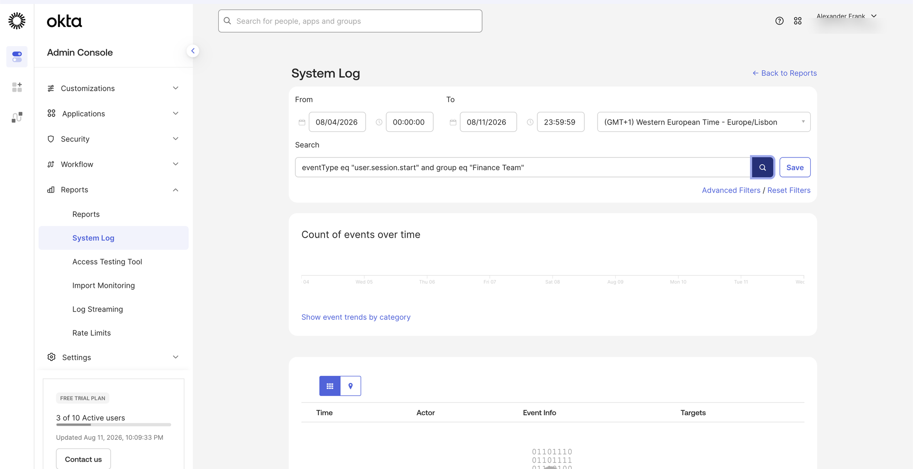

**Falsche Reset-Option**
- Symptom: Die Aufgabe verlangte ein temporäres Passwort plus Abmeldung aller Sitzungen. Ausgewählt war aber noch „Send a reset password email“.
- Behebung: „Create a temporary password“ wählen und „Sign out user“ aktiv lassen. Ohne das Beenden der Sitzungen bleibt eine bestehende Sitzung gültig, auch wenn das Passwort neu ist.

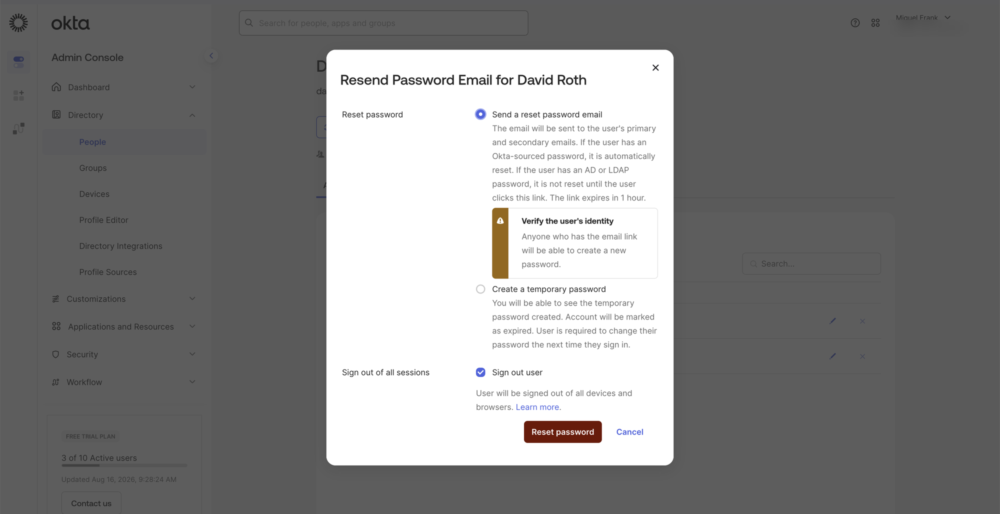

**Trial voll: 10 von 10 aktiven Benutzern**
- Symptom: Im zweiten Durchlauf konnte ich keine weiteren Testbenutzer anlegen.
- Behebung: Die Testdaten auf die Benutzer reduziert, die für die Aufgaben wirklich gebraucht werden.

**Custom Role + Resource Set nicht verstanden**
- Symptom: Im ersten Durchlauf habe ich diese Aufgabe ausgelassen, weil ich nicht wusste, wo was hingehört.
- Behebung: Rolle und Scope als zwei getrennte Fragen verstehen. Die Reihenfolge ist Resources → Roles → Admins (Abschnitt 2).

---

## Entra ID und Okta: Übersetzung

| Microsoft Entra | Okta |
|---|---|
| Tenant | Org |
| Dynamische Gruppe | Group Rule (muss aktiviert werden) |
| Schema-Erweiterung | Profile Editor → Add Attribute |
| Enterprise Application | App Integration |
| Conditional Access | Global Session Policy + Authentication Policy |
| Named Locations | Network Zones |
| Authentifizierungsmethoden | Authenticators (Setup + Enrollment) |
| SSPR | Password Policy → Regel mit Self-Service |
| Rollen + Administrative Units | Custom Role + Resource Set |
| Anmeldeprotokolle | System Log |

---

## Nächste Stufe

- Okta Integrator Free Plan einrichten (läuft nicht ab) und die SAML-Föderation mit JIT bis zum angelegten Benutzer in der Ziel-Org nachweisen.
- Okta AD Agent an dasselbe AD wie in [01](../01-hybrid-identity/) anbinden und den Lifecycle mit Entra Connect vergleichen.
